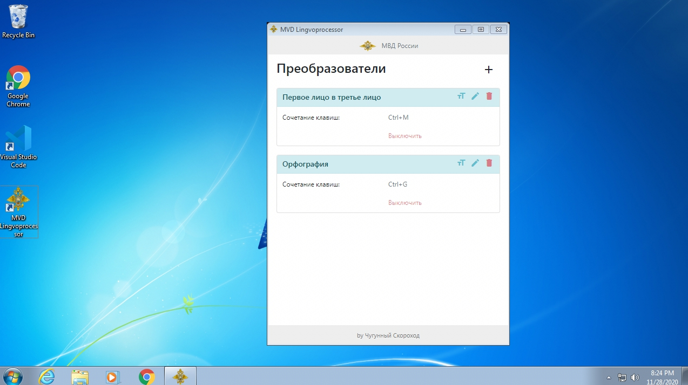
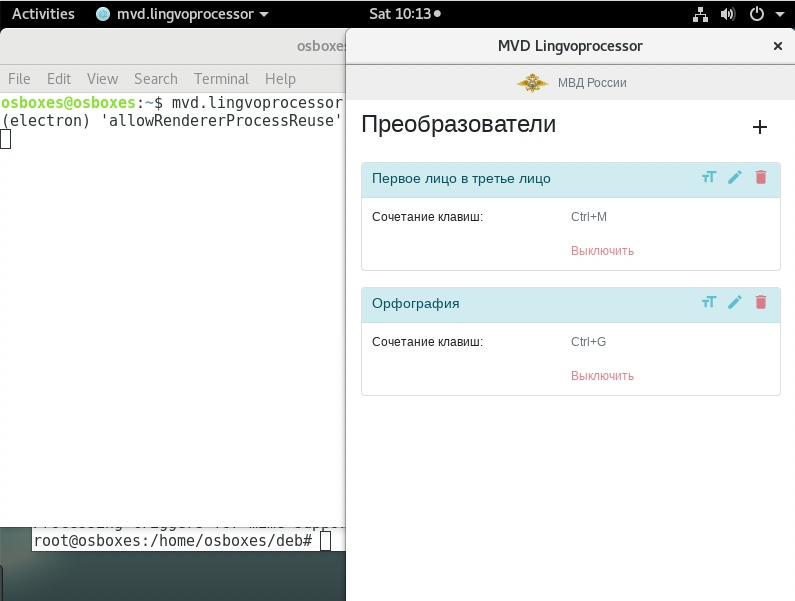

# Лингвопроцессор
Кроссплатформенный модульный лингивстический процессор для работы с текстом в оффлайн. 
В основе проекта лежат технологии для формирование единой кодовой базы для множества операционных систем и простого расшинерения возможностей путем написания модулей на JavaScript
 

## Скриншоты



  
## Готовые приложения
Ссылки на уже собранные приложения. 

| Операционная система | Версия системы |  Ссылка |
| ------ | ------ | ------ |
| Windows | 7, 8, 10 | [lingvoprocessor-win64.msi](https://cdn.dataswarm.ru/lingvoprocessor-win64.msi) |
| Denian | 9+ | [lingvoprocessor-debian.deb](https://cdn.dataswarm.ru/lingvoprocessor-debian.deb) |
| MacOs | 10.14+ | [lingvoprocessor-mac.zip](https://cdn.dataswarm.ru/lingvoprocessor-mac.zip) |

## Сборка приложений в режимe "очумелые ручки"

### Debian 9+
Для запуска системы требуется Docker и make
```shell script
make build build_linux
``` 