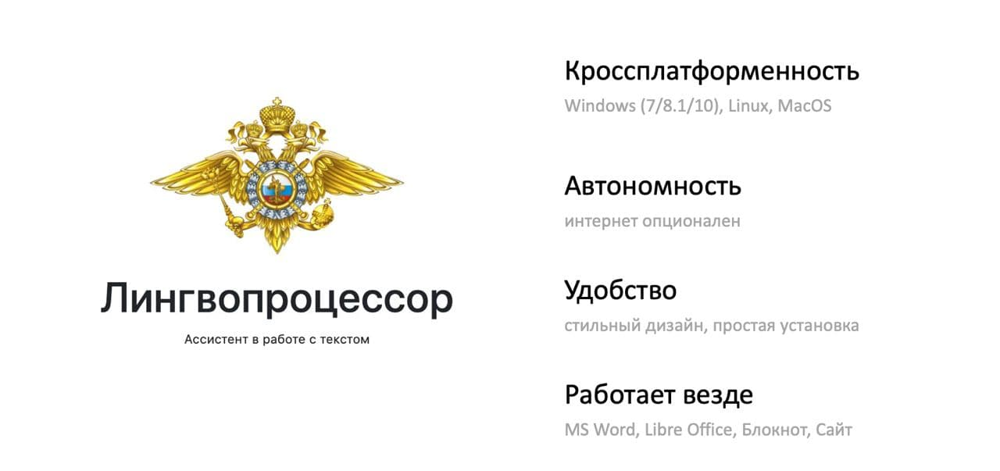

# Лингвопроцессор

Кроссплатформенное дескотопное приложение для работы с текстом. Выполнено в виде модулей, сейчас имеет 2 модуля:
- преобразование лица повествования от первого лица к третьему (автономно)
- исправление ошибок в тексте (через интернет, модуль добавлен как демонстрация способа расширения функционала и масштабирования)

Написано на [Electron Forge](https://www.electronforge.io/) + angular,  поддерживает Windows 7/8.1/10, Linux, macOS с одним кодом для всех платформ (в несколько раз удешевляет разработку). Установка с помощью файла-инсталлер (msi для windows и deb для линукс соответственно). 

Работает для любого текстового редактора (MS Word/Libre/блокнот/форма на сайте и т.д.). Каждый модуль имеет горячие клавиши для преобразования выделенного текста. Приложение работает в фоне и выключается в автозагрузку. Модульная система позволяет легко масштабировать приложение.

 

## Скриншоты
| x | Linux | Windows | macOS |
| --- | --- | --- | --- |
| Основной экран | [смотреть](/img/debian-editor.png) | [смотреть](/img/windows7.jpg) | - |
| Редактор | [смотреть](/img/debian-editor.jpg) | - | - |
  
## Готовые приложения
Ссылки на уже собранные приложения. 

| Операционная система | Версия системы |  Ссылка |
| ------ | ------ | ------ |
| Windows | 7, 8, 10 | [lingvoprocessor-win64.msi](https://cdn.dataswarm.ru/lingvoprocessor-win64.msi) |
| Denian | 9+ | [lingvoprocessor-debian.deb](https://cdn.dataswarm.ru/lingvoprocessor-debian.deb) |
| MacOs | 10.14+ | [lingvoprocessor-mac.zip](https://cdn.dataswarm.ru/lingvoprocessor-mac.zip) |

## Сборка приложений в режимe "очумелые ручки"

Обратите внимание, что сборка приложений самостоятельно предполагает, что вы понимаете технические аспекты сборки ПО.
### Windows 7, 8, 10
##### Подготовка 
Устанавливаем [NodeJS 12](https://nodejs.org/en/download/releases/) и 
[Visual C++ build tools](https://visualstudio.microsoft.com/ru/thank-you-downloading-visual-studio/?sku=BuildTools) или [Visual Studio 2017 Community (Desktop development with C++)](https://visualstudio.microsoft.com/pl/thank-you-downloading-visual-studio/?sku=Community).
Ставим [Git](https://git-scm.com/download/win).
Далее установите [WiX toolset](https://wixtoolset.org/releases/) и добавьте в PATH через `панель управления` и `редактирование окружающей` среды, путь(добавить bin) до каталога установленной прогараммы.
##### Сбор
Открываем CMD(в режиме администратора) и переходим в папку со скаченными исходниками средствами cmd. Далее в папку `app/angular-app` и ставим зависимости
```shell script
npm i
```
Далее собираем angular
```shell script
npm run build 
```  
Поднимаемся на директорию выше и выполняем установку зависимостей для электрона
```shell script
npm i
```
И делаем сборку проекта
```shell script
npm run make
```
Создается папка `out/make/x64/` в которой будет лежать инсталлятор приложения.

### Debian 9+
Для запуска системы требуется Docker и make
```shell script
make build build_linux
``` 
После этого будет создана папка `deb` в которой будет лежать файл `release.deb`. 
Переносим файл в систему и через терминал устанавливаем пакет.
```shell script
dpkg -i release.deb
```

### macOS 10.14+
Для запуска системы требуется `make`
##### Подготовка 
Устанвливаем [NodeJS 12](https://nodejs.org/en/download/releases/) и запускаем
```shell script
sudo xcode-select --install
```
Если возникает ошибка `xcode-select: error: command line tools are already installed, use "Software Update" to install updates`, то поможет следующая команда
```shell script
sudo rm -rf /Library/Developer/CommandLineTools && xcode-select --install
```
##### Сбор
```shell script
make build_macos
```
Создается папка `out/make/x64/` в которой будет лежать приложение.